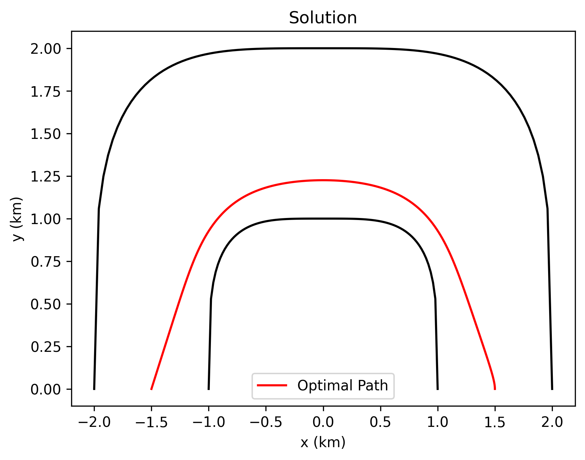

<p align="center">
  
</p>

<h1 align="center" style="text-align: center; width: fit-content; margin-left: auto; margin-right: auto;">Optimization of a Racetrack </h1>

## Summary

This project is meant to find the optimal path around a predefined racetrack given accelerationand resistance constraints

### 🌟 Features

- Pretty quick to run
- Attched pdf
- no errors
- Easy to run

## Tech Stack
- Language: Python
- Libraries: NumPy, SciPy, and MatplotLib
- Tools: Git, Jupyter Notebook

## Get started
Clone the repository
```bash
git clone https://github.com/yourusername/project-name.git
```
Then install dependencies
```bash
pip install numpy
pip install scipy
pip install matplotlib
```
## Potential other projects
The current project only evaluates one racetrack however changing the function of the racetrack may improve the overall project

## Results and Process
Results and proccess are located in the pdf located in the repository

## Thanks and other colaberators
Thank you to [Daniel Treuhaft](https://github.com/danman778) and [Teayoun Kim](https://github.com/TeayounK) for thier contributions to this project
